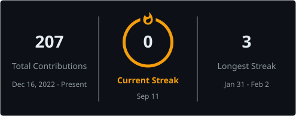
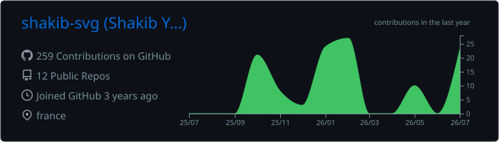
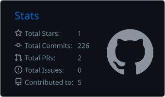
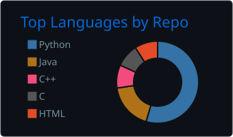

<!-- ============================================================ -->
<!-- GitHub Profile README — shakib-svg/shakib-svg                -->
<!-- Palette: bg #0D1117 · accent #F59E0B · text #E6EDF3 · grey #8B949E -->
<!-- ============================================================ -->

<!-- Decorative banner (non-essential, remote service) -->


<div align="center">

# Shakib Youssef

**AI & Computer Vision R&D Engineer in training — turning industrial and biomedical signals into explainable visual intelligence**

<!-- Discreet rotating subtitle (remote service; the static subtitle above remains if it fails) -->
<a href="https://github.com/shakib-svg">
  
</a>

<br/>

<a href="https://www.linkedin.com/in/ShakibYoussef"></a>&nbsp;
<a href="mailto:shakib.youssef@outlook.com"></a>&nbsp;
<a href="https://github.com/shakib-svg"></a>&nbsp;


<br/><br/>


</div>

<br/>

<!-- ================= PROFESSIONAL SNAPSHOT ================= -->

<table align="center">
  <tr>
    <td align="center" width="25%">🎓<br/><b>ENSTA</b><br/><sub>Institut Polytechnique<br/>de Paris</sub></td>
    <td align="center" width="25%">🔬<br/><b>R&D Intern</b><br/><sub>IFP Énergies Nouvelles<br/>Lyon</sub></td>
    <td align="center" width="25%">📄<br/><b>2 IEEE Papers</b><br/><sub>Peer-reviewed<br/>ICABME · ETECOM</sub></td>
    <td align="center" width="25%">🚀<br/><b>Available</b><br/><sub>October 2026<br/>R&D positions</sub></td>
  </tr>
</table>

---

## About me

I work at the intersection of **signal processing**, **deep learning**, and **computer vision**, with a focus on making models both accurate and explainable. My current research at IFPEN encodes multivariate industrial time series as images so that convolutional architectures — and their explainability tools — can detect and localize anomalies in complex physical systems. Before that, I applied the same signal-to-model philosophy to biomedical data: ECG-based atrial fibrillation detection (two IEEE publications), depth-camera pose estimation for medical robotics, and EEG-based brain–computer interfaces. What drives me is research that survives contact with real sensors, real noise, and real industrial constraints.

---

## 🔬 Current work — IFPEN

> ### Unsupervised anomaly detection on industrial time series through computer vision

**Pipeline**

```text
Multivariate signals → Image encoding (GADF · GASF · MTF) → Convolutional autoencoder
                     → Anomaly score → Explainability (Grad-CAM · LRP) → Sensor-level localization
```

- **Signal-to-image encoding** of multivariate sensor data using Gramian Angular Fields (GADF, GASF) and Markov Transition Fields (MTF)
- **Convolutional autoencoders** for fully unsupervised fault detection
- **Sensor-level fault localization** through Grad-CAM and Layer-wise Relevance Propagation (LRP)
- Validated on the **Tennessee Eastman Process** benchmark
- Complementary validation on **real industrial pilot data**

---

## 💼 Experience

| Period | Role | Organization |
|:---|:---|:---|
| 🟠 **Mar. 2026 – Present** | **R&D Intern — Computer Vision & Anomaly Detection** | **IFP Énergies Nouvelles** |
| May 2025 – Sep. 2025 | R&D Intern — Depth Cameras & Pose Estimation | Ivanae Medical / LaTIM |
| Dec. 2023 – Jun. 2024 | AI Engineer — License Plate Detection | RODOK SARL |
| May 2023 – Aug. 2023 | AI Engineer — Cardiac Signal Classification | Together for Chehim |

---

## 🧪 Featured projects

<table>
  <tr>
    <td width="50%" valign="top">
      <h3>🧠 ExpMedIa — Explainable AI in Medical Imaging</h3>
      <sub><b>ENSTA · 2025–2026</b></sub>
      <p>Explainability of chest X-ray models (CheXNet, PYLON) using Grad-CAM, Grad-CAM++, LRP, and Integrated Gradients for trustworthy medical imaging.</p>
      <!-- Add repository link when public: [Project repository](PROJECT_URL) -->
    </td>
    <td width="50%" valign="top">
      <h3>🧬 Brain Tumor Segmentation</h3>
      <sub><b>Personal project · 2024–2025</b></sub>
      <p>Transformer U-Net on multimodal MRI, targeting precise segmentation of the WT, TC, and ET tumor subregions.</p>
      <!-- Add repository link when public: [Project repository](PROJECT_URL) -->
    </td>
  </tr>
  <tr>
    <td width="50%" valign="top">
      <h3>📹 Multi-Camera Surveillance</h3>
      <sub><b>ENSTA · 2024–2025</b></sub>
      <p>Real-time multi-object detection and tracking with a YOLOv10 + DeepSORT pipeline on multi-stream video.</p>
      <!-- Add repository link when public: [Project repository](PROJECT_URL) -->
    </td>
    <td width="50%" valign="top">
      <h3>🧩 Brain–Computer Interface</h3>
      <sub><b>Université Libanaise · 2024</b></sub>
      <p>EEG signal processing, noise reduction, feature extraction, and machine-learning classification for BCI applications.</p>
      <!-- Add repository link when public: [Project repository](PROJECT_URL) -->
    </td>
  </tr>
</table>

---

## 📄 Publications

1. **Evaluating the Impact of EMD-Derived Intrinsic Mode Functions on Atrial Fibrillation Detection**
   *ICABME 2025* — DOI: [10.1109/ICABME66883.2025.11211811](https://doi.org/10.1109/ICABME66883.2025.11211811)

2. **A Data-Augmented Deep Hybrid Model for Atrial Fibrillation Detection**
   *ETECOM 2025* — DOI: [10.1109/ETECOM66111.2025.11319010](https://doi.org/10.1109/ETECOM66111.2025.11319010)

---

## 🛠️ Technical stack

<p align="center">
  
</p>

<details>
<summary><b>Full technical toolbox</b></summary>
<br/>

| Domain | Technologies |
|:---|:---|
| **AI & Computer Vision** | PyTorch · TensorFlow · OpenCV · MediaPipe · YOLO · scikit-learn · autoencoders · Transformers · explainability methods (Grad-CAM, LRP, Integrated Gradients) |
| **Data & Scientific Computing** | NumPy · Pandas · Matplotlib · Seaborn · signal processing · time-series analysis |
| **Programming Languages** | Python · C · C++ · Java · JavaScript · LaTeX |
| **Engineering Tools** | Git · Linux · Docker · VS Code · Google Colab |

</details>

---

## 🎓 Education

| Period | Degree | Institution |
|:---|:---|:---|
| 2024 – 2026 | **Engineering Diploma — Digital Systems Design** | ENSTA – Institut Polytechnique de Paris |
| 2021 – 2024 | Bachelor's Degree — Networks & Telecommunications | Université Libanaise |

---

## 🌍 Languages

- **Arabic** — Native
- **English** — TOEIC 940
- **French** — B2

---

## 📊 GitHub statistics

<!-- Locally generated SVGs (GitHub Actions) — reliable, no dead external services -->

<div align="center">

<a href="https://github.com/DenverCoder1/github-readme-streak-stats"></a>

<br/>





</div>

<!-- Optional external activity graph — placed after local stats on purpose.
     Remove this block if the service becomes unreliable. -->
<div align="center">
  
</div>

---

## 🤝 Let's talk

I am open to **R&D engineering positions in AI and Computer Vision** (from October 2026), as well as collaborations and technical discussions around:

**computer vision** · **signal processing** · **applied deep learning** · **industrial AI** · **explainable AI**

<div align="center">

📧 **[shakib.youssef@outlook.com](mailto:shakib.youssef@outlook.com)** &nbsp;·&nbsp; 💼 **[LinkedIn](https://www.linkedin.com/in/ShakibYoussef)**

</div>

<!-- Optional local illustration: place an image in assets/ and reference it here, e.g.
      -->


